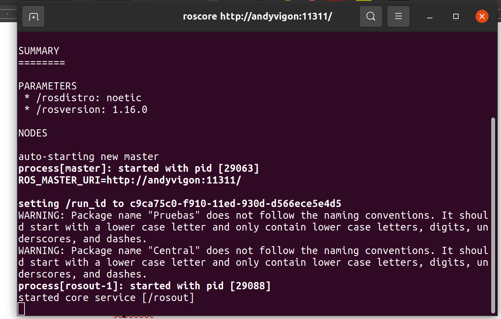

Paso 1 - Configura tu lista de fuentes
```
sudo sh -c 'echo "deb http://packages.ros.org/ros/ubuntu $(lsb_release -sc) main" > /etc/apt/sources.list.d/ros-latest.list'
```
Paso 2 - Configura tus llaves
```
sudo apt install curl # if you haven't already installed curl
curl -s https://raw.githubusercontent.com/ros/rosdistro/master/ros.asc | sudo apt-key add -
```
Paso 3 - Actualizacion de claves
```
sudo apt-key del 421C365BD9FF1F717815A3895523BAEEB01FA116
```
```
sudo -E apt-key adv --keyserver 'hkp://keyserver.ubuntu.com:80' --recv-key C1CF6E31E6BADE8868B172B4F42ED6FBAB17C654
```
Paso 3 - Instalacion :
```
sudo apt update
sudo apt install ros-noetic-desktop-full
```
Paso 4 - Configuración del entorno:
```
echo "source /opt/ros/noetic/setup.bash" >> ~/.bashrc
source ~/.bashrc
```
Paso 5 - Dependencias para construir paquetes :
```
sudo apt install python3-rosdep python3-rosinstall python3-rosinstall-generator python3-wstool build-essential
```
Paso 6 - Inicializacion de  rosdep :
```
sudo apt install python3-rosdep
```
Paso 7 - Inicio de rosdep
```
sudo rosdep init
rosdep update
```
Comprobación:
```
roscore 
```
   

[ir a Introducción]
