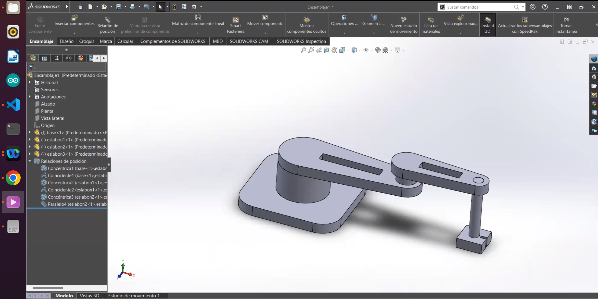

## Introducción a ROS y Coppeliasim

Este repositorio contiene una serie de instrucciones para abordar la programacion de robots con ROS y coppealiasim usando python.

# Contenido
* [0. Prerrequisitos ](#0-Prerrequisitos )
    * [0.1 Instalación de Ubuntu](#01-Instalación-de-Ubuntu)
    * [0.2 Instalación de ROS](#02-Instalación-de-ROS)
* [1. Introducción](#1-Introducción)
* [2. GitHub y ROS  ](#2-GitHub-y-ROS )
* [3. Paquetes y Nodos ](#3-Paquetes-y-Nodos)
* [4. Comunicación entre Nodos](#4-Comunicación-entre-Nodos)
    * [4.1 Estructura de mensajes](#Mensajes)
    * [4.2 Mensajes Propios](#Mensajes-propios)
* [5. Servicios y Acciones](#5-Servicios-y-Acciones)
* [6. Robot 3 GDL y RViz](#6-Robot-3-GDL-y-RViz)
* [7. Comunicación con dispositivos](#7-Comunicación-con-dispositivos)
* [8. Rviz MoveiT](#8-Rviz-MoveiT)
* [9. Coppeliasim](#9-Coppeliasim)
  
# 0. Prerrequisitos
# 0.1 Instalación de Ubuntu

Para el funcionamiento de ROS es necesario instalar Ubuntu, para el actual repositorio se usará Ubuntu 20 y ROS NOETIC.

Imagen ISO (ubuntu-20.04.6-desktop-amd64.iso): [Descarga](https://releases.ubuntu.com/focal/)

Opción Máquina Virtual:[Tutorial](./Doc/0-Maquina-Virtual.md)

Opcion Partición del disco (Cambiar por la Iso 20.04): [Tutorial](https://www.youtube.com/watch?v=_d6oT7rEoGc)

Verificación de instalación de Python

Ejecuto en la terminal
```
python3 --version
```

# 0.2 Instalación de ROS

Enlace Oficial ROS Noetic: [link](https://wiki.ros.org/noetic/Installation/Ubuntu)

Instalación de ROS Noetic en Ubuntu 20.04 

A continuación, ejecutar todos los comandos en el terminal:

[***1-Instalacion ROS***](./Doc/0_Instalacion.md)
# 1. Introducción
Conceptos generales sobre el uso de ROS [Resumen](./Doc/1_ROS.pdf)

[Wiki-ROS-Conceptos](https://wiki.ros.org/es/ROS/Conceptos)

[Wiki-ROS-Tutoriales](https://wiki.ros.org/ROS/Tutorials)

[***1- Ejemplo***](./Clases/1-Introduccion-Paquetes.md)
# 2. GitHub y ROS 

GitHub y ROS (Robot Operating System) están estrechamente relacionados en el desarrollo de software robótico:

1. **Alojamiento del Código**

Los desarrolladores de ROS usan GitHub para almacenar y gestionar el código fuente de sus paquetes de ROS en repositorios públicos o privados.

2. **Gestión de Dependencias** 

GitHub permite organizar proyectos de ROS en múltiples repositorios y submódulos, facilitando la gestión de dependencias entre paquetes.

3. **Colaboración**

GitHub proporciona herramientas como pull requests e issues, esenciales para la colaboración en proyectos de ROS, permitiendo a los desarrolladores contribuir y mejorar el software colectivamente.

4. **Versionado y Lanzamientos**

Los proyectos de ROS utilizan GitHub para etiquetar versiones y crear lanzamientos, asegurando que los usuarios puedan acceder a versiones específicas y estables del software.

5. **Integración Continua**

Con servicios de CI como GitHub Actions, los desarrolladores de ROS pueden automatizar pruebas y compilaciones, garantizando la calidad del código antes de su integración.

6. **Documentación**

GitHub facilita la publicación de documentación y guías de uso directamente en los repositorios, complementando la wiki oficial de ROS.

[Tutorial recomendado](https://www.youtube.com/watch?v=mBYSUUnMt9M&t=14612s)

[***2-Comandos Básicos***](./Clases/2-comandos-github.md)

# 3. Paquetes y Nodos
1. Paquetes en ROS

Un paquete en ROS es la unidad básica de organización del software. Un paquete puede contener nodos, bibliotecas, archivos de configuración, archivos de lanzamiento, mensajes, servicios y otros recursos necesarios para el desarrollo y ejecución de un sistema robótico.

**Estructura de un Paquete:**

* CMakeLists.txt: Archivo de configuración de CMake que describe cómo compilar el paquete.
* package.xml: Archivo de metadatos que contiene información sobre el paquete, como el nombre, la versión, las dependencias y el mantenedor.
* src/: Directorio que contiene el código fuente del paquete.
* include/: Directorio que contiene archivos de encabezado (headers) para bibliotecas.
* launch/: Directorio que contiene archivos de lanzamiento (launch files) utilizados para iniciar nodos y configurar el sistema.
* msg/: Directorio para definir mensajes personalizados que los nodos pueden intercambiar.
* srv/: Directorio para definir servicios personalizados.
  
**Funciones de un Paquete:**

* Modularidad: Permite dividir el sistema en módulos manejables y reutilizables.
* Gestión de Dependencias: Facilita la gestión de dependencias, asegurando que todas las bibliotecas y herramientas necesarias estén disponibles.
* Distribución: Facilita la distribución y la colaboración, ya que los paquetes pueden ser compartidos y reutilizados por otros desarrolladores.

2. Nodos en ROS

Un nodo en ROS es una instancia de un proceso que realiza cálculos. En un sistema robótico complejo, múltiples nodos se ejecutan simultáneamente, cada uno realizando tareas específicas y comunicándose entre sí.

**Características de los Nodos**

* Independencia: Cada nodo es un proceso independiente que puede ejecutarse en la misma máquina o en diferentes máquinas dentro de una red.
* Comunicación: Los nodos se comunican entre sí utilizando mensajes, temas (topics), servicios y acciones.
* Modularidad: Facilita la modularización del software, permitiendo que diferentes funcionalidades sean desarrolladas y mantenidas de manera independiente.

[***3-Ejemplo***](./Clases/3-0-Paquetes.md)
# 4. Comunicación entre Nodos

* Mensajes y Temas: Los nodos pueden publicar y suscribirse a temas para intercambiar mensajes. Por ejemplo, un nodo de cámara puede publicar imágenes en un tema, mientras que un nodo de procesamiento de imágenes se suscribe a ese tema para recibir y procesar las imágenes.
## Mensajes de ROS
Los paquetes de mensajes de ROS contien una serie de estructuras para lograr el intercambio de información dependiento del tipo de dato que se requira intercambiar.
## Mensajes propios
ROS nos da la versatilidad de crear nuestras propias estructuras para el intercambio de información esto lo podemos lograr a través de la creación de nuestros propios mensajes.

 [***4-Ejemplo***](./Clases/3-1-mensajes.md)
# 5. Servicios y Acciones
* Servicios: Permiten la comunicación de solicitud-respuesta entre nodos. Un nodo puede ofrecer un servicio y otro nodo puede llamarlo para realizar una operación específica.

[Fuente oficial](https://wiki.ros.org/srv)

[Ejemplos](./Clases/5-1-Servicios.md)

* Acciones: Son similares a los servicios, pero están diseñados para operaciones que pueden tardar un tiempo indeterminado y requieren feedback durante su ejecución.

[Ejemplos](./Clases/5-2-Acciones.md)

# 6. Robot 3 GDL y RViz

A continuacion, para implementar el uso de la herramienta de visualización virtual RVIZ, diseñaremos un robots de 3 grados de libertad RRP, el diseño CAD se puede implementar en SOLIDWORKS, INVENTOR, FUSION, entre otros.

El objetivo es definir las relaciones entre eslabones y generar un archivo URDF. 




[Ejemplo](./Clases/6-Archivos-URDF.md)
# 7. Comunicación con dispositivos

En ROS (Robot Operating System), se pueden utilizar varias tecnologías para la comunicación entre nodos y dispositivos externos, cada una con sus propias características y casos de uso.

# Comunicación Serial
La comunicación serial es una forma de comunicación de datos en la que los bits de datos se envían de uno en uno a lo largo de un solo canal. Es comúnmente utilizada para comunicarse con dispositivos embebidos, sensores y actuadores.

## Integración con ROS
Para integrar dispositivos seriales con ROS, se suele utilizar el paquete rosserial. Este paquete proporciona soporte para la comunicación entre ROS y microcontroladores que ejecutan firmware compatible con ROS.

[Ejemplo](./Clases/7-1-Comunicacion-Serial.md)

# MQTT (Message Queuing Telemetry Transport)
MQTT es un protocolo ligero de mensajería de publicación/suscripción que es ideal para dispositivos con recursos limitados y redes con ancho de banda reducido. Se utiliza ampliamente en aplicaciones de IoT.

[Ejemplo](./Clases/7-2-Comunicacion-MQTT.md)

# 8. Rviz MoveiT
Instalar las dependencias
   gazebo_ros_pkgs: <http://gazebosim.org/tutorials?tut=ros_installing> 
   
   ros_control: <http://wiki.ros.org/ros_control> 
   
   moveit_core: <https://moveit.ros.org/install/>  
# 9. Coppeliasim

CoppeliaSim es un simulador de robots que permite diseñar, programar, y probar sistemas robóticos en un entorno virtual antes de implementarlos en hardware real. Soporta una variedad de robots, sensores, actuadores y entornos, y se destaca por su flexibilidad y la integración de varias herramientas para el desarrollo robótico.
## Instalación
1. Ingresamos a la página oficial de Coppeliasim [link](https://www.coppeliarobotics.com/), seleccionamos la opción Coppeliasim EDU, y descargamos la versión para Ubuntu 20.04.
2. Descomprimimos la carpeta
3. Ejecutamos el comando
```
sudo ./coppeliaSim.sh
```

Simulación 

Para abordar los elementos básicos de la simulación se recomienda utilizar el siguiente tutorial [IK en CoppeliaSim (Tutorial)](https://www.youtube.com/watch?v=dB8ebrjUPdQ)

9.1 ROS and Coppeliasim

El simulador de Coppeliasim es compatible con la arquitectura de ROS a través de la interfaz de ROS ( libsimROS.so ), su estructura se basa en el uso de tópicos y nodos que permitan cominicarse con el entorno virtual de Coppealiasim y manipular las acciones del robot.

Para emparejar ROS con Coppealiasim se deben seguir los siguientes pasos:
1. Dentro de la terminal de Coppealiasim ejecutamos el comando:
```
simROS = require('simROS')
```
este comando nos permite verificar si las dependencias necesarias para su uso están correctamente instaladas, de existir errores es necesario realizar los sigueintes pasos:

2. Dentro del espacio de trabajo para este caso curso_2024_ws/src copiamos los paquetes  "sim_ros_interface" y "ros_bubble_rob"  que se encuentra en la direccion: (carpetasimulador)/programming/ros_packages
   
4. Abrimos una terminal desde el workspace y colocamos los siguientes comandos:
```
echo 'export COPPELIASIM_ROOT_DIR=/ruta/carpetasimulador' >> ~/.bashrc
source ~/.bashrc
```

```
echo 'export CMAKE_PREFIX_PATH=/ruta/carpetasimulador' >> ~/.bashrc
source ~/.bashrc

```
